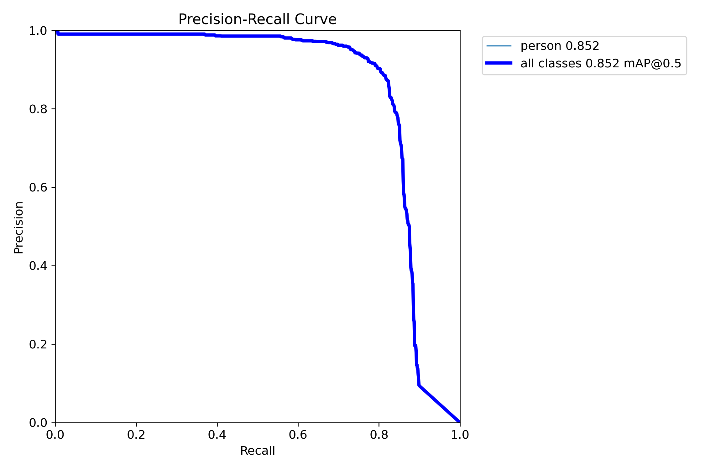
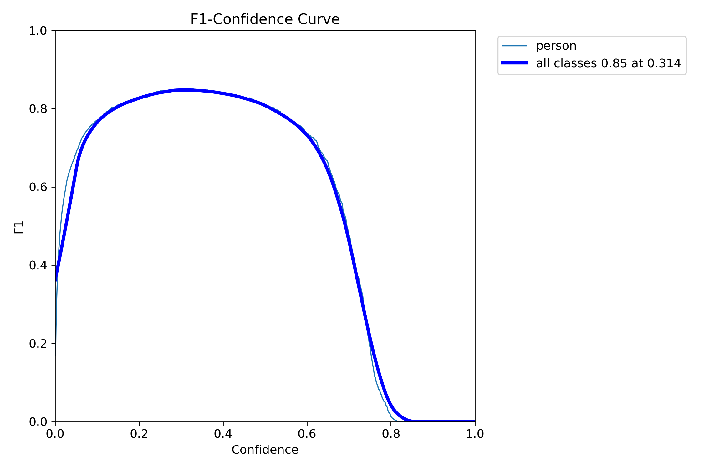

## 📌 Описание проекта
### Топ-10 решение в рамках Международного форума Архипелаг (Сколково) 2025
Данный проект направлен на автоматическую детекцию людей на изображениях, полученных с **беспилотных авиационных систем (БАС)**, с использованием современных нейросетевых технологий.
В работе:

* Выполнена **предобработка датасета**: масштабирование изображений, удаление выбросов.
* Произведено **дообучение модели YOLO11n** на очищенном наборе данных.
* Проведена **валидация модели** с построением ключевых метрик.
* Реализован **постпроцессинг** предсказаний:

  * Clipping предсказанных рамок.
  * Non-Maximum Suppression (NMS).
  * Фильтрация по размерам bounding box.

---

## 🔍 Процесс работы

### 1. Предобработка данных

https://www.kaggle.com/code/vasilyartonkin/splitting-data
  
* **Масштабирование изображений** для унификации размера.
* **Удаление выбросов** для улучшения качества данных.
* **Разбиение выборки** на обучающую, валидационную, тестовую
  
### 2. Обучение модели

https://www.kaggle.com/code/vasilyartonkin/training-yolo11n

* Использована архитектура **YOLO11n** как лёгкая и быстрая модель для инференса на UAV.
* Дообучение на кастомном наборе данных.
* Использование аугментаций для повышения обобщающей способности.

### 3. Валидация

https://www.kaggle.com/code/vasilyartonkin/validation-cv

* Оценка по метрикам **Precision**, **Recall**, **mAP50-95**.
* Построение кривых **PR** и графика **F1 vs Confidence**.

### 4. Постпроцессинг

* **Clipping** рамок для исключения выхода за границы изображения.
* **Non-Maximum Suppression** (NMS) для удаления дубликатов.
* Фильтрация рамок по минимальному размеру.

---

## 📊 Результаты

### Precision-Recall кривая

### F1 Score Confidence

---

## 🛠 Используемые технологии

* **[YOLO11n](https://github.com/ultralytics/ultralytics)**
* PyTorch
* OpenCV
* Albumentations
* NumPy / Pandas
* Matplotlib / Seaborn

---
